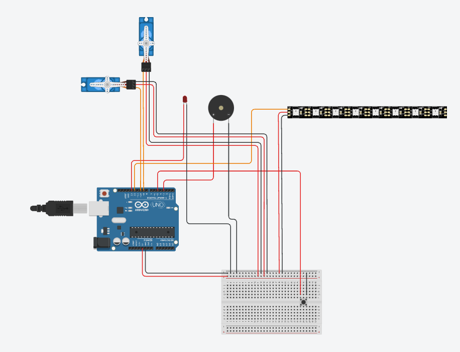
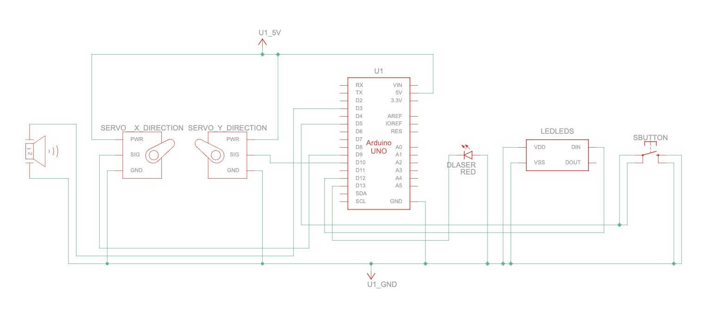

# Installation

### Software Requirements:
- Python 3.x
- Necessary Python libraries (listed below)
- Arduino IDE

Packages
- check requirements.txt

### Hardware Requirements

- An Ardunio
- Necessary hardware modules (listed below)
- Eye tracking hardware (see hardware setup guide)
- Arduino-compatible device
- Webcam or integrated camera

Hardware Modules
- 1 Arduino Uno /R3/R4
- 2 Micro Servos
- 1 Pan-tilt Bracket
- 1 Laser module (Note TinkerCad does not have Laser Module so i replaced it with an LED)
- 4 LED Strips
- 1 Buzzer
- 1 Button
- 1 Breadboard
- Neccessary number of wires

[TinkerCad Link](https://www.tinkercad.com/things/hbdBevcn4zu-eyetracker-?sharecode=pFWRcWMHXZaVKUqXxHB7ckLPEXDNkKYSklO1osI9qO0)

### Booth Diagram:

### Circuit Diagram:

### Hardware Setup
1. Connect your Arduino device
2. Upload the provided Arduino sketch (`arduino/eyetracker_arduino.ino`)

### Software Installation
1. Download the latest release from [Releases](https://github.com/dionyichia/EyeTracker/releases)
2. Extract the downloaded file
3. Run `EyeTracker.exe` (Windows) or `EyeTracker.app` (macOS)

## 📋 System Requirements

### Windows
- Windows 10 or later
- 4GB RAM minimum, 8GB recommended
- USB ports for hardware connections

### macOS
- macOS 10.14 or later
- 4GB RAM minimum, 8GB recommended
- USB ports for hardware connections

### Linux
- Ubuntu 18.04+ or equivalent
- 4GB RAM minimum, 8GB recommended
- USB ports for hardware connections